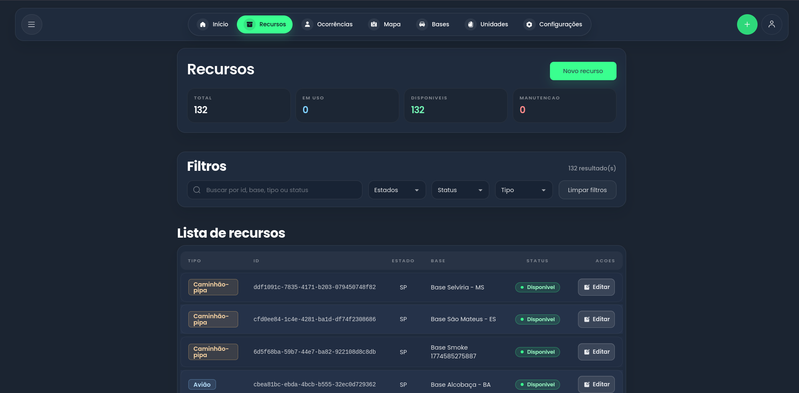
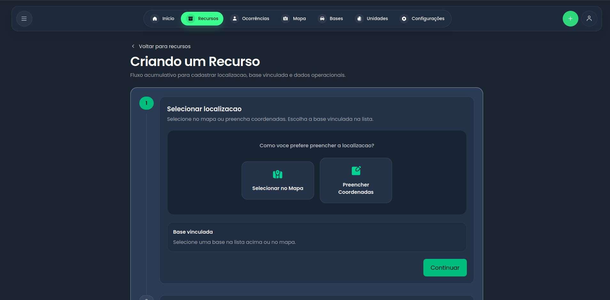
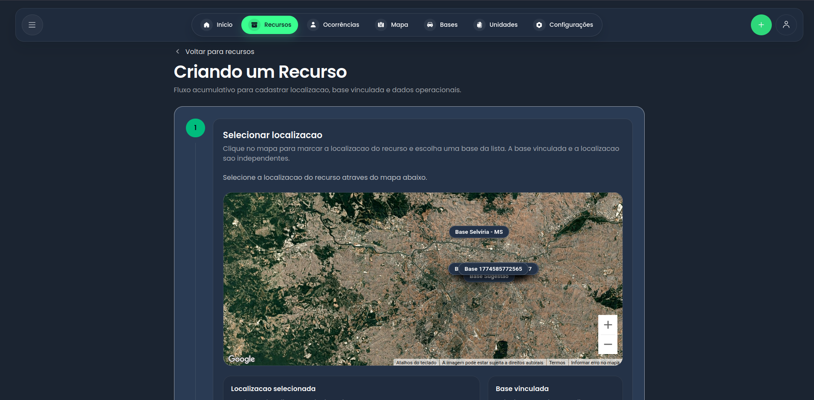
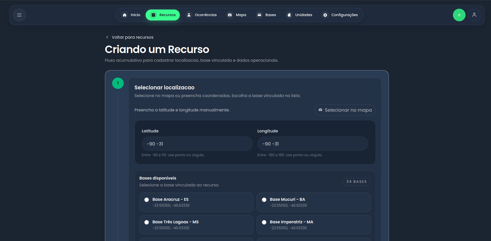
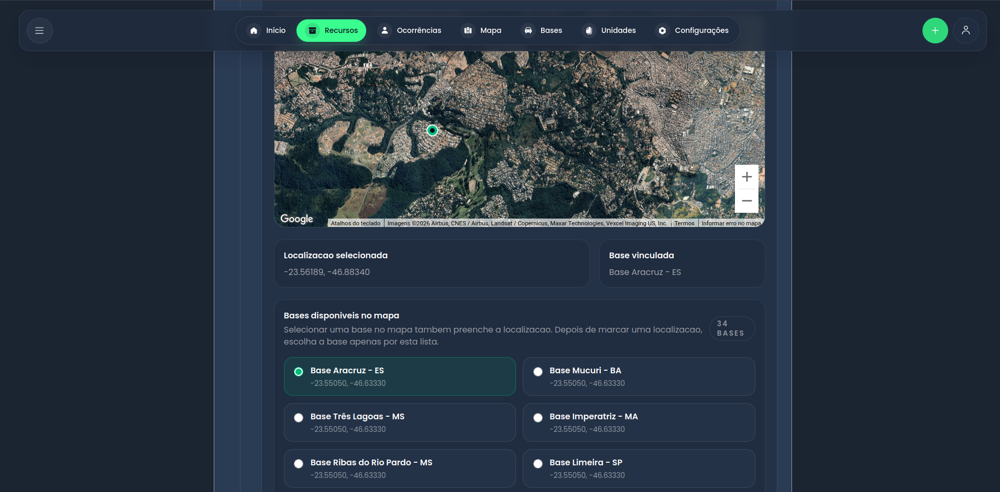
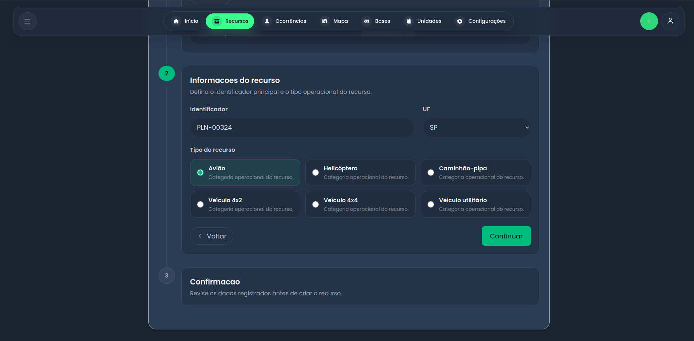
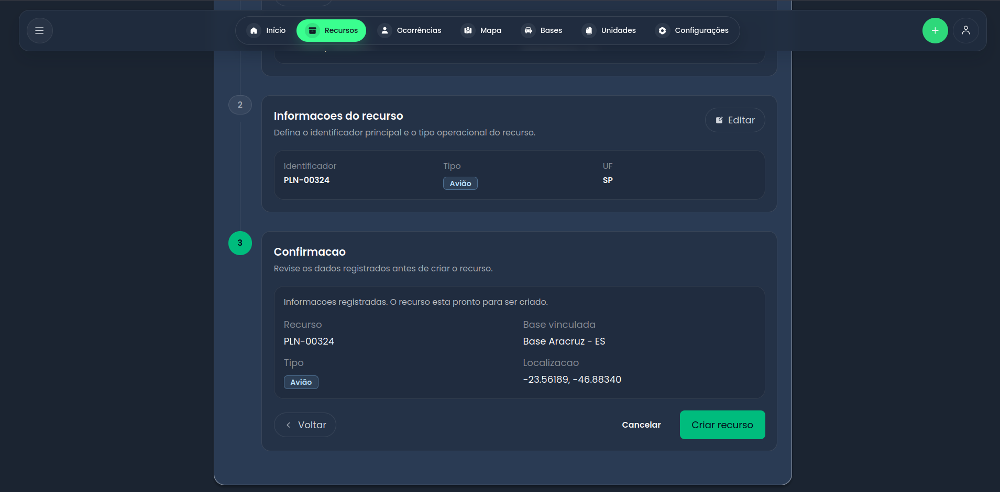

# Atividade Ponderada - Roteiro e Teste de Usabilidade

## Tela analisada

Esta atividade está focada na **tela de criação de um novo recurso** do sistema FireOff. O fluxo permite registrar um recurso operacional a partir de um processo em etapas, combinando a seleção da localização no mapa, a vinculação com uma base e a definição dos dados principais do recurso.

## 1. Objetivo da atividade

O objetivo desta atividade é avaliar a clareza, a consistência visual e a facilidade de uso do fluxo de cadastro de um novo recurso, verificando se o usuário consegue concluir a tarefa sem dificuldades relevantes.

Mais especificamente, a análise busca entender se o sistema permite:

- Selecionar corretamente a localização do recurso no mapa.
- Vincular o recurso a uma base operacional.
- Preencher os dados principais do recurso com segurança.
- Revisar as informações antes da confirmação final.
- Concluir o cadastro com uma percepção clara de progresso.

## 2. Tipo de teste

O teste aplicado nesta atividade é um **teste de usabilidade com foco em tarefa e fluxo**. A proposta é observar como o usuário interage com uma sequência de telas que simulam o cadastro de um novo recurso, identificando pontos de atrito, dúvidas e oportunidades de melhoria na interface.

## 3. Roteiro do teste

O roteiro foi organizado em etapas para acompanhar o raciocínio esperado do usuário durante a criação do recurso:

1. Clicar no botão de criar nova ocorrência (imagem recursos1).
2. Escolher selecionar um local no mapa ou preencher coordenadas (imagem recursos2).
3. Selecionar a base vinculada ao recurso (imagem recursos5).
4. Definir o identificador principal e o tipo operacional do recurso (imagem recursos6).
5. Revisar os dados registrados antes de criar o recurso (imagem recursos7).

## 4. Conjunto de perguntas

As perguntas abaixo foram organizadas com lógica de funil, começando por compreensão geral e avançando para validação do fluxo:

1. O que você entende que deve ser feito para criar um novo recurso?
2. Você consegue identificar onde selecionar a localização do recurso?
3. A relação entre mapa, base vinculada e dados do recurso está clara?
4. Em algum momento do fluxo você ficou em dúvida sobre o próximo passo?
5. As informações apresentadas na etapa de confirmação são suficientes para validar o cadastro?

## 5. Ação esperada do usuário

Ao final do fluxo, o usuário deve ser capaz de:

- Compreender que o cadastro é dividido em etapas.
- Interagir com o mapa para escolher a localização.
- Selecionar uma base vinculada antes de seguir para os dados do recurso.
- Preencher os campos necessários sem perder o contexto da tarefa.
- Revisar o resumo final e concluir a criação do recurso.

## 6. Análise do fluxo por etapas

### 6.1 Etapa 1 - Clicar no botão de criar nova ocorrência (imagem recursos1)

Nesta etapa, o usuário inicia o fluxo de criação do recurso ao clicar no botão de criar nova ocorrência.

### 6.2 Etapa 2 - Escolher local no mapa ou preencher coordenadas (imagens recursos2, recursos3 e recursos4)

Nesta etapa, o usuário escolhe como informar a localização do recurso.

Tela de escolha da forma de preenchimento:

Opção A: selecionar no mapa:

Opção B: preencher coordenadas:

### 6.3 Etapa 3 - Selecionar a base vinculada ao recurso (imagem recursos5)

Após definir a localização, o usuário seleciona a base vinculada ao recurso.

### 6.4 Etapa 4 - Definir identificador principal e tipo operacional (imagem recursos6)

Nesta etapa, o usuário define o identificador principal e o tipo operacional do recurso.

### 6.5 Etapa 5 - Revisar os dados antes de criar o recurso (imagem recursos7)

Na etapa final, o usuário revisa os dados registrados antes de concluir a criação do recurso.

## 7. Resultados esperados do teste

Com base neste fluxo, espera-se identificar:

- Se o usuário compreende a sequência de cadastro sem ajuda externa.
- Se o mapa realmente contribui para a tarefa ou gera dúvidas.
- Se a transição entre etapas está clara.
- Se a etapa de revisão reduz erros de preenchimento.
- Se a interface transmite segurança na confirmação final.

## 8. Conclusão

A tela de criação de novo recurso apresenta um fluxo bem estruturado, com etapas claras e boa organização visual. A divisão do processo em fases reduz a complexidade percebida e ajuda o usuário a entender o que precisa ser feito em cada momento.

No geral, o cadastro do recurso está alinhado a uma abordagem de usabilidade orientada à tarefa, com potencial para ser ainda mais eficiente com pequenos ajustes de feedback, orientação e destaque visual.
